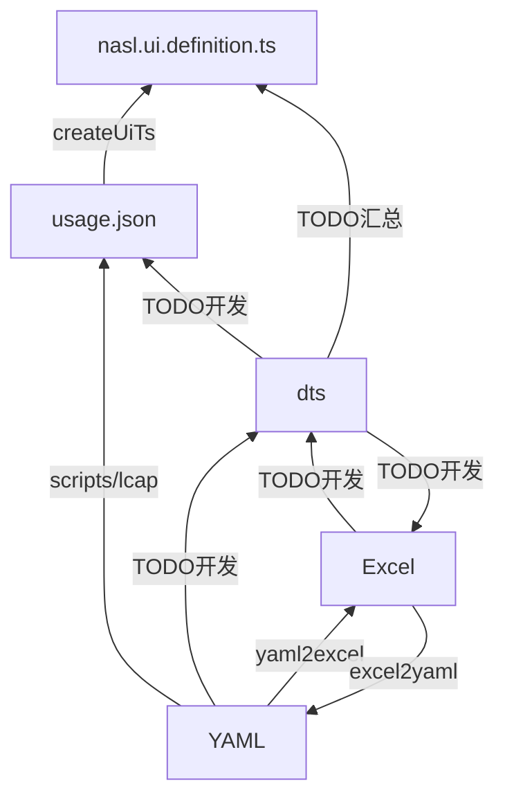

# 低代码 UI 组件库汇总

## 组件 API 规范升级

由于组件 API 规范升级影响面较广，所以可能有一段临时态的情况：



- [ ] YAML --> dts
- [ ] dts --> Excel
- [ ] dts --> usage.json
- [ ] Excel --> dts
- [ ] 汇总 ui.definition

## 目录

- pc-ui
- h5-ui

## 脚本

### 生成 Excel

```shell
node scripts/yaml2excel.js
```

### 解析 Excel

```shell
node scripts/excel2yaml.js
```