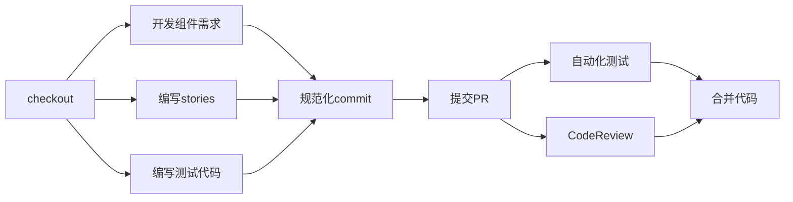

# Lcap UI
 
CodeWave Low Code AI Platform UI Components

## Get Start
此仓库使用 [pnpm](https://pnpm.io/zh/installation) 来进行包管理, 强制要求使用 `node >= v18.17.0`

```bash
pnpm install

pnpm start
```

## 仓库目录介绍

### 全局仓库目录

```
|-- lcap-ui
|---- libraries                         // ui 库
|------ pc-ui                           // PC 端 UI 库（Vue2.6 CloudUI）
|------ mobile-ui                       // Mobile 端 UI 库（Vue2.6 vant）
|------ pc-react-ui                     // PC 端 UI 库（React AntD）
|------ mobile-react-ui                 // Mobile 端 UI 库 （React） (待规划)
|---- packages                          // 其他工具库
|------ cli                             // 工程命令相关库
|------ validator                       // 表单验证库 【待规划】
|------ ...                             // 其他公共依赖
|------ package.json                    // 项目文件，version 跟随ide 版本，
```

### 组件库仓库

```
|-- pc-ui
|-- .storybook                       // storybook 配置
|---- main.js
|---- preview.js
|-- src
|---- components                     // 组件目录
|---- styles                         // 样式相关目录，例如 normalize.css, 主题变量文件
|---- index.ts                       // 打包入口文件
|-- test                             // 测试代码
|---- coverage                       // 单测覆盖率文件（不提交）
|---- setup.js                       // 单元测试启动文件
|-- lcap-ui.config.js                // 组件打包配置 （向IDE 输出组件配置）
|-- package.json                     // 组件库项目文件 名称 @lcap/pc-ui
|-- vite.config.js                   // vite 开发、构建、测试 配置文件
|-- tsconfig.json                    // Typescript 配置文件
|-- tsconfig.api.json                // api.ts 编译配置文件
```

- 组件仓库名称规范： `[端]-[框架]-ui` , 目前vue2.6 是默认框架，所以 直接是 `pc-ui` `mobile-ui`
- 示例给出标准组件库仓库，目前有的仓库并不是这个结构，后续会逐步向标准靠拢；
- `lcap-ui.config.js`  主要配置与ide 内容构建（主题变量、组件配置描述）
- 仓库使用 vite + storybook 作为 开发 & 构建方案，后面内容过多，打包时间 > 3min 后，考虑使用 rspack 做构建；

## Git 流程管理

### 分支描述

| 分支名称 | 用途描述 |
| --- | --- |
| master | 主分支，与线上最新版本代码保持一致，只运行同步release 相关操作更新代码； |
| develop | 开发分支, 包含下个迭代所有的feature 代码；提交功能迭代PR 都合并到这个分支； |
| release/vx.x.x  | 功能迭代发布，发版本之前从develop checkout 出来分支，发布之后合并代码到  master 和 develop 分支， 生成 tag 。 vx.x 版本跟随ide版本，例如： release/v3.7.3 release/v3.7.3-1  |
| hotfix/vx.x.x | bug fix 迭代发布分支, tag/x.x.x  checkout出分支，用于修复某个分支版本的问题, 发布之后合并代码到  master 和 develop 分支， 生成 tag 。vx.x 版本跟随ide版本，例如： release/v3.7.3 release/v3.7.3-1  |
| feature/xxx  | 功能开发分支， 每个功能创建一个分支, 合并到 develop 分支, 合并之后删除 |
| fix/xxx  | 修复bug 分支，从 hotfix/release 创建，也 pr 到hotfix分支每个组件的bug，单独创建一个分支， 合并之后删除 |
| ci/xxx | 工程代码更新或bugfix， 从develop分支创建，合并到develop分支 |
| next | 大版本更新时分支，最后会替换 master 分支 |
| old  | 大版本更新时，旧版本master代码更新成old,或者是版本号 1.x, 0.x 等 |

### 提交规范

```
pnpm commit

<type>(<scope>): <subject>
// 空一行
<body>
// 空一行
<footer>
```

由三个字段组成：type（必需）、scope（可选）、subject（必需）

**Type**

type 必须是下面的其中之一：

- feat: 增加新功能
- fix: 修复 bug
- docs: 只改动了文档相关的内容
- style: 不影响代码含义的改动，例如去掉空格、改变缩进、增删分号
- refactor: 代码重构时使用，既不是新增功能也不是代码的bud修复
- perf: 提高性能的修改
- test: 添加或修改测试代码
- build: 构建工具或者外部依赖包的修改，比如更新依赖包的版本
- ci: 持续集成的配置文件或者脚本的修改
- chore: 杂项，其他不需要修改源代码或不需要修改测试代码的修改
- revert: 撤销某次提交

**Scope**

用于说明本次提交的影响范围。scope 依据项目而定，例如在业务项目中可以依据菜单或者功能模块划分，如果是组件库开发，则可以依据组件划分, 例如：`feat(Button):`  fix(Button):

**Subject**

主题包含对更改的简洁描述, 注意三点：
1. 使用祈使语气，现在时，比如使用 "change" 而不是 "changed" 或者 ”changes“
2. 第一个字母不要大写
3. 末尾不要以.结尾

**Body**

主要包含对主题的进一步描述，同样的，应该使用祈使语气，包含本次修改的动机并将其与之前的行为进行对比。

**Footer**

包含此次提交有关重大更改的信息，引用此次提交关闭的issue地址，如果代码的提交是不兼容变更或关闭缺陷，则Footer必需，否则可以省略。

## 组件构成


### 组件目录

```
|-- Button
|---- stories
|------ block.stories.ts                      // 代码区块示例
|------ Button.stories.ts                     // 组件开发调试demo
|---- tests
|------ fixes                                 // 修复bug时的单测代码
|------ features                              // 有功能增加时每个功能新增单测
|------ Button.test.ts                        // 组件测试代码
|---- api.ts                                  // 组件描述文件
|---- Button.tsx                              // 对原组件（antd, vant..）的扩展
|---- index.ts                                // 组件导出文件
```

## 开发流程



### 组件开发

**UI组件开发**

**插件化扩展功能 & IDE 适配**

**api.ts 组件描述文件编写**

[](http://nasl.codewave.163.com:8080/draft-code/2023/07/20/完善前端组件的-ts-定义)

### 编写stories

**调试 demo 编写**

[How to write stories • Storybook docs](https://storybook.js.org/docs/writing-stories)

**block.stories.jsx**

```tsx
import React from 'react';
import Select, { SelectOption } from '../index';

export default {
  title: 'Example/Select/blocks',
  component: Select,
};

// React
export const defaultUse = {
	name: '基础用法',
  render: () => {
    return (
      <Select style={{ width: 256 }} placeholder="请选择">
        <SelectOption key="1" label="1" value="1" />
        <SelectOption key="2" label="2" value="2" disabled />
      </Select>
    );
  },
};

// Vue
export const defaultUse = {
	name: '基础用法',
	render: () => {
		return {
			template: `
<cw-select style="width: 256px;" placeholder="请选择" >
	<cw-select-option label="1" value="1" />
	<cw-select-option label="2" value="2" />
</cw-select>
`
		};
	};
};
```

- 每个demo 必需写 `name`   与  `render` 参数；
- 不要用 args 来驱动组件渲染；

### 编写测试代码

**UI 渲染测试**

- 对已有组件封装时，无需写基础的渲染测试
- 针对组件每种状态进行渲染测试，生成 `snapshot`

```tsx
import React from 'react';
import { expect, test } from 'vitest';
import renderer from 'react-test-renderer';
import { Button } from 'antd';

test('Render Default Button', () => {
  const wrapper = renderer.create(<Button />);
  expect(wrapper.toJSON()).toMatchSnapshot();
});

test('Render Primary Button', () => {
  const wrapper = renderer.create(<Button type="primary" />);
  expect(wrapper.toJSON()).toMatchSnapshot();
});

// ... 
```

**功能测试**

针对api.ts 对外暴露的参数进行功能交互测试, 例如： 按钮点击，选择框选中， 数据源加载等等；

## 贡献指南

修改代码请阅读我们的 [贡献指南](./.github/CONTRIBUTING.md)。

## 资源

* [pnpm](https://pnpm.io/zh/installation)
* [vite](https://vitejs.dev/)
* [vitest](https://cn.vitest.dev/guide/)
* [storybook](https://storybook.js.org/docs/get-started/install)
* [rspack](https://www.rspack.dev/)
