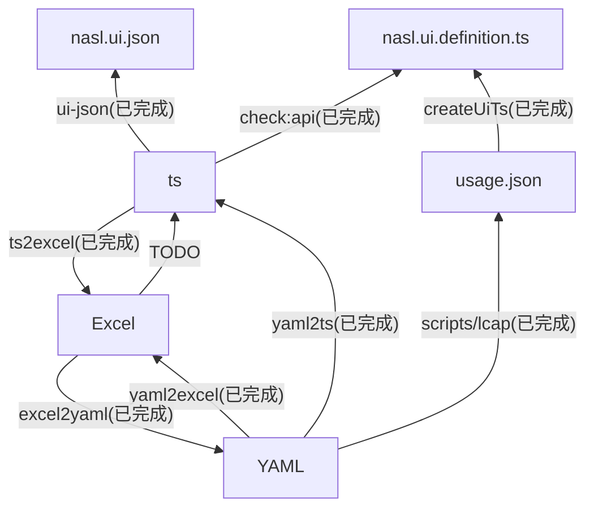

# 低代码 UI 组件库汇总

## 组件 API 规范升级

由于组件 API 规范升级影响面较广，所以可能有一段临时态的情况：



- [x] YAML --> ts
  - [x] 基本信息
  - [x] 组件属性
  - [x] 可访问的组件属性
  - [x] 组件方法
  - [x] 组件插槽
- [x] ts --> usage.json
- [x] ts --> Excel
- [ ] Excel --> ts
- [x] 测试 nasl.ui

## 目录

- pc-ui
- h5-ui

## 脚本

### 生成 Excel

```shell
node scripts/yaml2excel.js
```

### 解析 Excel

```shell
node scripts/excel2yaml.js
```

### 从 TS 生成 Excel

```shell
node scripts/ts2excel.js
```
### 从 yaml 生成 ts

```shell
node scripts/yaml2ts.js
```
